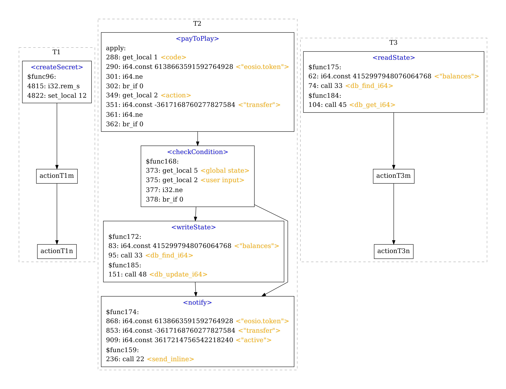

# VetEOS

VetEOS is a state-of-the-art static analysis framework for the “Groundhog Day” Vulnerabilities (GDVs) in EOSIO smart contracts.

## Groundhog Day Vulnerability

In a Groundhog Day attack, adversaries can exploit the unique rollback problem in EOSIO contracts to retry executing the same contract code repeatedly with different inputs. With leaked information observed during previous executions, attackers illegally accumulate knowledge about the victim contract, so as to learn how to make illicit profits in a deterministic manner. We detect GDVs based on the following 4 key factors.

### Four key factors:

- **(_F1_) Revertable:** A sequence of activities locate in a single transaction that can be reverted entirely, so that a malicious user can rerun it _unlimitedly_ for free.
- **(_F2_) Unpredictably profitable:** Whether one can make profits legally from a vulnerable contract is unpredictable. It relies on a _secret_ condition the contract uses to evaluate participants’ inputs.
- **(_F3_) Information leakage:** A state is changed in the middle of the revertable transaction. The state change is _visible_ outside this transaction.
- **(_F4_) Causal inference:** The change to the visible state is caused by the invisible comparison between a user _input_ and the secret, and therefore can be used to infer the comparison result.

## Environment and Dependencies

### Environment

- Ubuntu >= 16.04
- Python >= 3.5

### Dependencies

- wasm
- graphviz
- timeout-decorator

## Usage

### Download VetEOS

```bash
git clone https://github.com/VetEOSIO/VetEOS.git
```

### Install Dependencies

```bash
python3 install_dependencies.py
```

### Detect GDV

```bash
python3 main.py -f <filepath> -g -d
```

Example:

```bash
python3 main.py -f samples/30758713_14_0.wasm -g -d
```

### Run VetEOS Terminal (WIP)

```bash
python3 main.py -v
```

## Run Test

### Basic Test

```bash
python3 tests/test_dependencies.py
```

Expected Results:

```
wasm test passed.
graphviz test passed.
timeout_decorator test passed.
All dependency tests passed.
```

### GDV Detection Test

```bash
bash tests/test_GDV.sh
```

Expected Results:

```
Analyzing file: samples/127922358_8_0.wasm
Analyzing file: samples/127926023_31_0.wasm
Analyzing file: samples/127926269_6_0.wasm
Analyzing file: samples/153965273_9_0.wasm
Analyzing file: samples/209093393_2_0.wasm
Analyzing file: samples/30758713_14_0.wasm
Analyzing file: samples/31645645_29_0.wasm
Analyzing file: samples/63459288_16_0.wasm
Analyzing file: samples/63464623_4_0.wasm
Analyzing file: samples/63467919_7_0.wasm
Analyzing file: samples/63914559_23_0.wasm
Analyzing file: samples/63944572_37_0.wasm
Analyzing file: samples/63946053_12_0.wasm
Analyzing file: samples/63946568_11_0.wasm
Analyzing file: samples/64243784_23_0.wasm
Analyzing file: samples/66017822_10_0.wasm
Analyzing file: samples/69973977_37_0.wasm
Analyzing file: samples/70312874_5_0.wasm
Analyzing file: samples/72430415_4_0.wasm
Analyzing file: samples/72583065_10_0.wasm
Analyzing file: samples/72602858_11_0.wasm
Analyzing file: samples/72603478_10_0.wasm
Analyzing file: samples/76382615_19_0.wasm
Analyzing file: samples/88160916_2_0.wasm
Total number of files analyzed: 24
Detected Groundhog Day Vulnerabilities: 24
Results are stored in ./results/
```

- The logs and generated analysis summary graphs will be stored in `./results/`.

- Example of analysis log: [./results/example.log](./results/example.log)

- Example of analysis summary graph: [./results/example.pdf](./results/example.pdf)

  

### Dataflow Analysis Test

```bash
bash tests/test_dataflow.sh
```

Expected Results:

- You will see a process of automatic dataflow tracking testing through the VetEOS terminal.
- Example output: [./results/example_output_dataflow_test.log](./results/example_output_dataflow_test.log)
