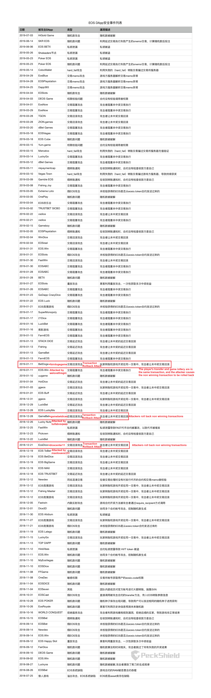

# Attack Evidence

## 1 Official Information

The reports from PeckShield’s GitHub: https://github.com/peckshield/EOS/tree/master/known_dapp_attacks

Translated:

## 2 Blogs and Transaction Records

### 2.1 *dicecenter11* (attacked by *maotoueos333*)

- Blog: CoinOn(Chinese): https://www.coinonpro.com/datareport/12371.html

  Translate:

  >Title: Data shows that in January 2019, a total of 26 EOS guessing game attacks occurred, with the four major gangs earning hundreds of thousands of yuan in profits
  >
  >Text: According to data from blockchain security company PeckShield, in the past month, there have been a total of 26 hacking attacks on guessing games on the EOS public chain. Developers have lost a total of 37247 EOS, with an estimated total value of over 550000 yuan at the current price of 15 yuan. Compared to last month, the profit from hacker attacks has significantly decreased, with BETX losing 7126 EOS at a time, and most of the attack losses have dropped to within 1000 EOS. Nearly half of the attacks that occurred in January were transaction blocking attacks (CVS-2019-6199), which is a common problem in guessing games and has not yet been fully fixed. There is still a possibility of further spread. We have detected that the attackers in January were mainly four hacker groups led by *floatingsnow*, ***maotoueos333***, *111alpha1111*, and *happyhappy51*. This reminds game developers to be vigilant and suggests removing controllable variables and predictable information on the chain to participate in random number generation, in order to avoid asset losses caused by blocking attacks as much as possible.

- Transaction records: https://bloks.io/account/dicecenter11 transaction page 39 shows the transactions between *dicecenter11* and *maotoueos333*, which is helpful to confirm the existence of the attacks.

### 2.2 *fairdogegame* (attacked by *welovethisgm*)

- Transaction records: https://bloks.io/account/welovethisgm transaction page 1~2 shows the transactions between *fairdogegame* and *welovethisgm*, which is helpful to confirm the existence of the attacks.

### 2.3 *gamebetdices* (attacked by *tuifabvsqwas*)

- SlowMist (English): https://hacked.slowmist.io/?c=EOS&page=4

- Blog: TuoniaoX.com (Chinese): https://www.tuoniaox.com/news/p-299552.html

  Translate:

  >Title: Gamebet Attack Event Analysis and ToBet Attack Event Follow up
  >
  >Author: Lianan Technology
  >
  >Summary: Recently, game contracts may face intensive rollback attacks
  >
  >
  >
  >Text: According to the technical team of Beosin (Chengdu Lianan), on the morning of the 28th, the hacker account tuifabvsqwas launched a rollback attack on GameBet game contract (***gamebetdices***), profiting from hundreds of EOS bets by failing to roll back:
  >
  >The risk control system correlation scan found that hackers have been conducting attack tests on accounts *shuabgsghdas* and ***tuifabvsqwas***  since a few days ago. During this period, ToBet (*tobetiotoken* *tobetioadmin*) was also attacked through account ***shuabgsghdas***. ToBet underwent read write separation and repair operations since being rolled back by the account *kfexzmkuhat* on the 19th, but the account *shuabgsghdas* on the 25th used similar methods to steal EOS and TOB tokens again, The difference in attack methods is that now attackers only roll back betting operations on failed transactions, while betting operations on successful transactions are no longer rolled back.
  >
  >Beosin (Chengdu Lianan) reminds: Recently, game developers may face intensive rollback attacks. Users who use out of contract lottery methods should be vigilant and take precautions.
  >
  >
  >
  >Reference link:
  >
  >PeckShield: EOS guessing game GameBet suffers a transaction rollback attack
  >
  >https://www.jinse.com/lives/73416.htm
  >
  >Source: LiananTech (ID: LiananTech)

- Transaction records: https://bloks.io/account/tuifabvsqwas transaction page 1~34 shows the transactions between *gamebetdice*s and *tuifabvsqwas*, which is helpful to confirm the existence of the attacks.